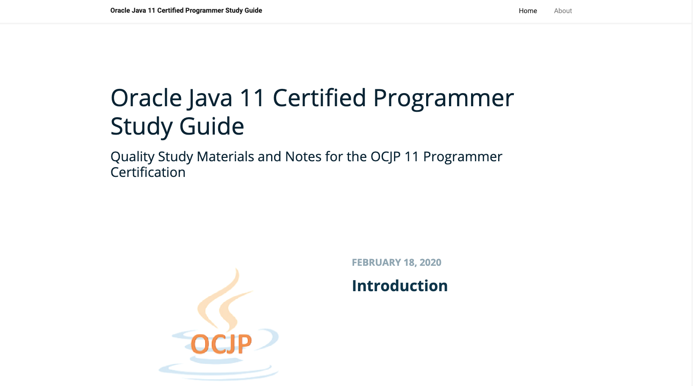

# ocjp11-study-guide
Oracle Certified Professional Java SE 11 Study Guide Website. Please visit the Website by clicking on the project link above.

# Motivation
I build this website since I want to help for the people studying the OCP SE 11 Certification 
by providing something easy to read on mobile devices or on the go.

Therefore, if any adjustment is needed or you have the same motivation to contribute to this work, please don't hesitate to give me your feedback.

Thank you very much, and I hope that everyone will pass the exam using the materials hosted here.

# How I Generate the Website?
I use the static site generator Hugo and the beautiful theme [Chucky Poster](https://github.com/puresyntax71/hugo-theme-chunky-poster) to build this website.

# License
Licensed under the Creative Commons Legal Code CC0 1.0 Universal
